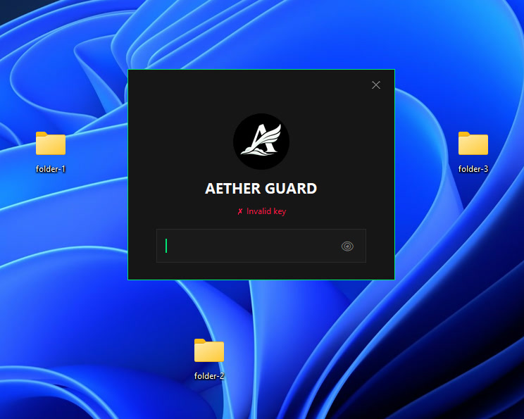

<p align="center">
  
</p>

<br>

**Aether Guard** is a sleek, modern, and lightweight folder protection utility for Windows. It provides an additional layer of security by monitoring active Windows Explorer windows and requiring password authentication to access them.

## ✨ Features

- **Real-time Protection**: Actively monitors Windows Explorer and closes unauthorized windows instantly.
- **Anti-Brute Force**: Sophisticated rate-limiting system that implements exponential backoff after failed attempts.
- **Session Grace Period**: Stay authenticated for a configurable amount of time (default: 5 minutes) without needing to re-enter your key.
- **Single Instance Enforcement**: Automatically detects if the application is already running to prevent redundant processes.
- **Stealthy Execution**: Support for VBS startup to run without a visible console window.


## 🚀 Getting Started

### Prerequisites

- **OS**: Windows 10/11 (Required for Windows API integration)
- **Python**: Version 3.8 or higher

### Installation

1.  **Clone the Repository**:

    ```bash
    git clone https://github.com/xkintaro/aether-guard.git
    cd aether-guard
    ```

2.  **Install Dependencies**:
    You can use the provided batch script for easy installation:
    `bash
    install-requirements.bat
    `
    _Alternatively, via pip:_
    `bash
    pip install -r requirements.txt
    `
    

## 🛠 Usage

1.  **Launch the Application**:
    - Run `run.bat` for a console-attached session.
    - Run `run-aether-guard.vbs` to start in the background.
2.  **Authentication**:
    - **Default Password**: `1234`
    - When you try to open a folder, a modern UI will prompt for your access key.
3.  **To Close**:
    - If running in a console, press `Ctrl+C`.
    - Otherwise, end the process via Task Manager.

## ⚙️ Configuration

Open `app.py` to modify the `Config` class settings:

```python
class Config:
    DEFAULT_PASSWORD = "1234"    # Your master access key
    MAX_ATTEMPTS = 5             # Attempts allowed before lockout
    LOCKOUT_TIME = 60            # Initial lockout duration in seconds
    GRACE_PERIOD = 300           # Authorized session duration (5 mins)
```

---

<p align="center">
  <sub>❤️ Developed by Kintaro.</sub>
</p>
